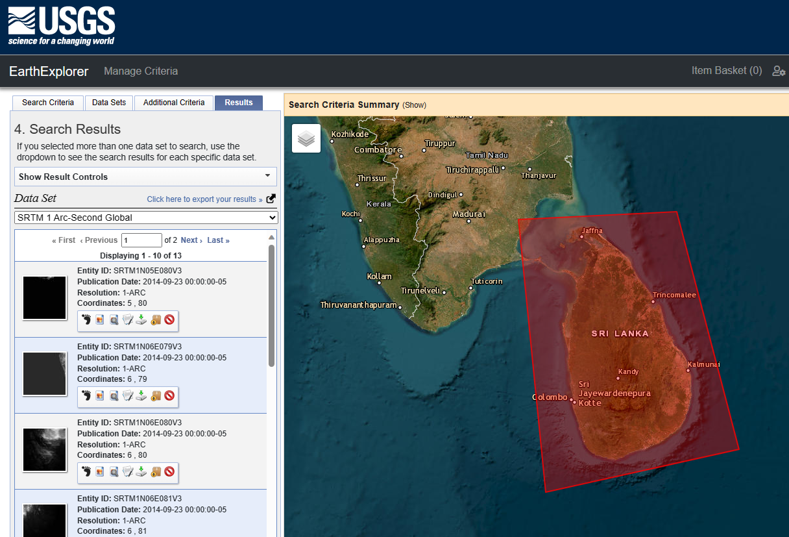

# Altitude information for Sri Lanka

## Install

```bash
pip install alt_lk-nuuuwan
```

See also [pypi.org](https://pypi.org/project/alt-lk-nuuuwan/)

## Examples

### [example0.py](examples/example0.py)

```python
from alt_lk import Alt, LatLng

latlng_sri_paada = LatLng(6.809498226498262, 80.49925188865949)
alt = Alt.from_latlng(latlng_sri_paada)

print(alt)
>> 2,193m / 7,195ft

print(alt.alt_m)
>> 2193.0

print(alt.alt_ft)
>> 7194.88212

print(str(alt))
>> 2,193m / 7,195ft

latlng_piduruthalagala = LatLng(lat=7.001665, lng=80.772689)
latlng_kirigalpotta = LatLng(lat=6.813, lng=80.783)
latlng_thotapola = LatLng(lat=6.833, lng=80.82)

alts = Alt.list_from_latlng_list(
    [
        latlng_piduruthalagala,
        latlng_kirigalpotta,
        latlng_thotapola,
    ]
)

for alt in alts:
    print(alt.alt_m)

>> 2513
>> 2292
>> 2351

```


## Data

This library uses **1 arc-second Digital Elevation Models (DEMs)** from the [United States Geological Survey](https://earthexplorer.usgs.gov/).



### Digital Elevation Model (DEM)

DEM is a 3D representation of a terrain's surface created from terrain elevation data. It's a digital model or 3D representation of a terrain's surface — typically of the Earth's surface, but it can be of other planets. DEMs are used in geography, cartography, and surveying, as well as in disciplines like civil engineering, environmental studies, and archaeology.

### 1 arc-second

This refers to the spatial resolution of the DEM. One arc-second is 1/3600th of a degree of latitude or longitude. Therefore, a one arc-second resolution means each pixel or grid cell in the DEM represents a square of the Earth's surface that is one arc-second by one arc-second in size. This roughly translates to about 30 meters by 30 meters at the equator, although the actual ground distance covered by one arc-second varies slightly with latitude due to the Earth's curvature. Thus, an area one latitude by one longitude, is represented by a grid of 3601 by 3601 cells.
